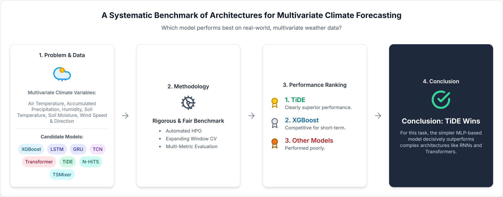
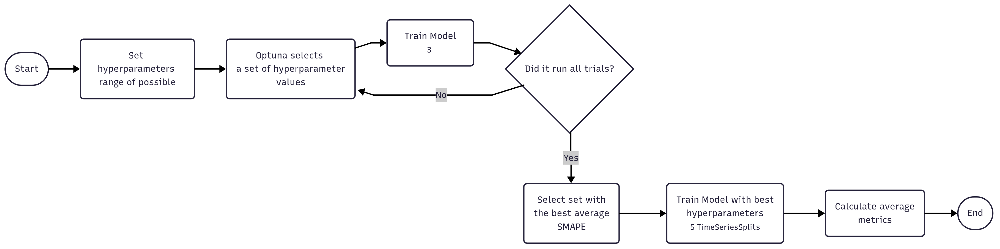
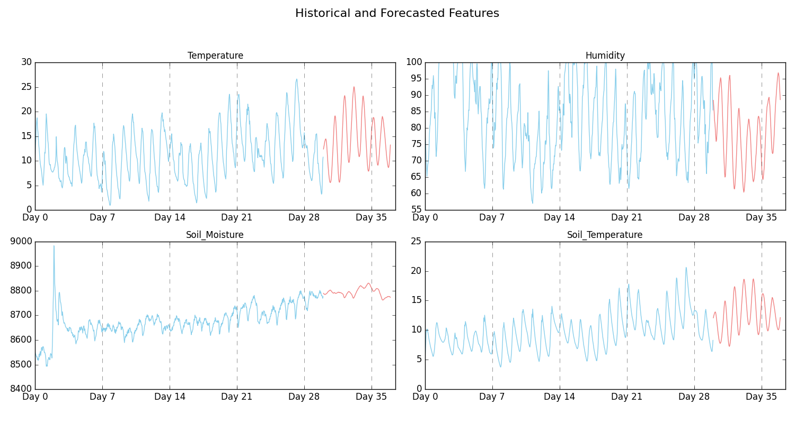
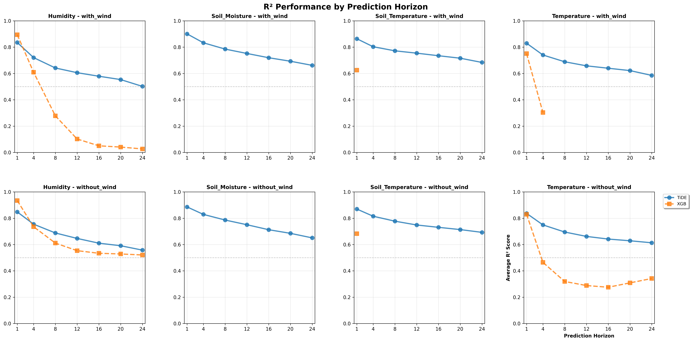
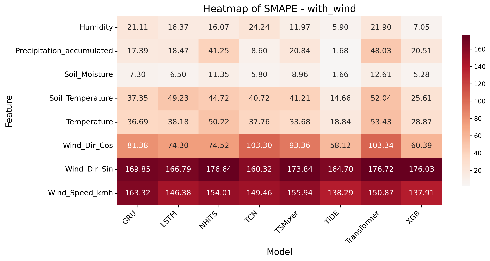
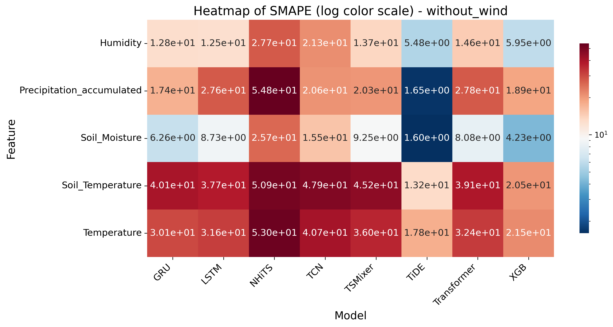
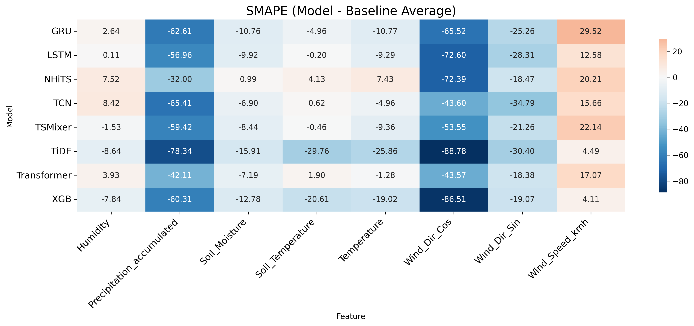

---

# 🌦️ A Unified Benchmark of Deep Learning and Gradient Boosting Models for Multivariate Autoregressive Weather Forecasting

This repository contains the code and experiments for the paper:
**"A Unified Benchmark of Deep Learning and Gradient Boosting Models for Multivariate Autoregressive Weather Forecasting with Real-World Data."**

---

## 📜 Abstract

Given the increasing diversity of machine learning architectures, selecting an optimal model for multivariate weather forecasting is a significant challenge.
This study addresses this issue by providing a **systematic benchmark** for researchers and practitioners.

We thoroughly compare **eight prominent models** from different architectural families:
**GRU**, **LSTM**, **TCN**, **Transformer**, **TiDE**, **N-HiTS**, **TSMixer**, and **XGBoost** — under a unified and fair methodology.

**Key findings:**

* 🏆 The MLP-based model **TiDE** consistently outperformed other architectures.
* ⏱️ **XGBoost** was competitive only for **very short-term (1-hour)** forecasts.
* ⚠️ Remaining models (e.g., LSTM, GRU, Transformer) performed **poorly** overall.

  

---

## ✨ Highlights

* 📊 Systematic benchmark of **8 models** for autoregressive weather forecasting.
* 🧠 **TiDE** excelled in multivariate forecasting across all variables.
* 🔻 **LSTM**, **GRU**, and **Transformer** underperformed even compared to a baseline.
* 🧪 **XGBoost** worked only for very **short-term** predictions.
* 💨 **Wind variables** remained a challenge for **all** models.

---

## ⚙️ Methodology

The experimental design ensured **fairness** and **robustness** across all models:

* **📅 Dataset**:
  One year of **hourly data** from a real-world weather station, including:

  * Temperature, precipitation, humidity, soil metrics, wind components
  * Temporal features (via sine/cosine encodings)

* **🔍 Hyperparameter Optimization (HPO)**:
  Using **Optuna** to tune each model based on **median SMAPE** over 3 cross-validation splits.

* **🧪 Final Evaluation**:
  Performed with **5-split expanding window cross-validation** (`TimeSeriesSplit`).

* **📏 Metrics**:

  * MAE, MSE, RMSE, R², SMAPE, and WMAPE

  

---

## 🧠 Models Compared

We evaluated eight models from distinct architectural families:

| Category              | Models                |
| --------------------- | --------------------- |
| 🌲 Gradient Boosting  | XGBoost               |
| 🔁 Recurrent Nets     | LSTM, GRU             |
| 🧩 Convolutional Nets | TCN                   |
| 🧠 Attention-Based    | Transformer           |
| 🧮 MLP-Based          | TiDE, N-HiTS, TSMixer |

---

## 📈 Key Results

### ✅ TiDE: Best Overall Performance

* Achieved **strong performance** across most variables and forecast horizons.
* Shows that **non-linear interactions** at each time step may matter more than long-range dependencies.

  

---

### ❌ Poor Performance of Other Architectures

* Models like **LSTM**, **GRU**, and **Transformer** performed **worse than a baseline**.
* Negative **R² scores** in many cases.

  

---

### ⏱️ Short-Term Advantage of XGBoost

* Competitive only for **1-hour forecasts**
* Accuracy **dropped quickly** for longer horizons.

---

### 📉 Feature-Wise Performance

* **TiDE** had the **lowest SMAPE** across most variables.
* Removing wind features did **not consistently improve** performance.

  
   
  

  

  

---
